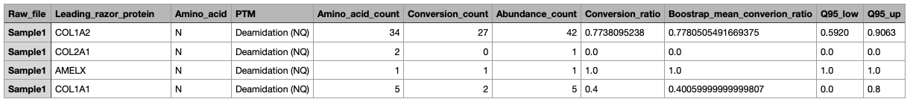
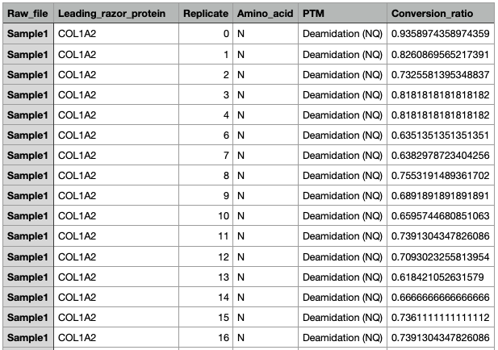

# PTM ratio calculator

The **ptm_ratio.py** script takes an evidence.txt MaxQuant file and calculates a PTM conversion ratio between the modified / unmodified amino acid version. The normalisation of the process is performed by relative abundance values, such as PSM or Intensity, and the ratio can be computed per raw file and protein. Each conversion ratio is by default supported using 1000 bootstrap replicates.

**Disclaimer1**: The script has been tested only using an evidence.txt file from *MaxQuant v2.0.2*

**Disclaimer2**: ptm_ratio.sh, ptm.txt and the /script folder are custom-made flavours (coded by Guille) to sistematically run the script under many PTMs. The ussage of those is not described in this README.md but in the notes within ptm_ratio.sh.

## Requirements

-   Python v3.11.7 (it may also work in other versions)

-   Pandas v2.2.0

## How do I use it?

Just type `python3 ptm_ratio.py -h` or `python3 ptm_ratio.py --help` to see the execution parameters. In detail, the option parameters are:

**Mandatory**

-   `--evidence-file` (`-e`); The path to the MaxQuant evidence.txt file
-   `--ptm` (`-p`); The amino acid + PTM pattern, present in the way it's written in the 'Modified sequence' column. e.g. "Q(Deamidation (NQ))" or "(Glu-\>pyro-Glu)E"

**Optional**

-   `--output-path` (`-o`); The path to locate the folder with the results (default: evidence.txt containing folder).
-   `--abundance-column` (`-a`); The column name indicating the abundance value employed to normalise the data. This can rather be "MS/MS counts" for PSM or "Intensity" for intensity (default: "MS/MS counts").
-   `--per-protein` OR `--no-per-protein`; Indicate if the ratio is also computed per protein (default: True).
-   `--remove-contaminants` OR `--no-remove-contaminants`; Indicate if the contaminant and reverse proteins are removed to calculate the ratio (default: True).
-   `--bootstrap` OR `--no-bootstrap`; Indicate if the 1000 bootstrap replicates are computed (default: True).

The following code line exemplifies the way to execute the script to calculate the Q deamidation ratio without excluding the contaminants:

```{python}
python3 ptm_ratio.py -e /example/path/evidence.txt -p "Q(Deamidation (NQ))" --no-remove-contaminants 
```

## Output explanation

The main output of this script is the **Conversion ratio csv** (bulk_conversion_ratio.csv or per_protein_conversion_ratio.csv):



-   **Amino_acid_count**: Number of amino acids employed to calculate the conversion ratio.
-   **Conversion_count**: Number of modified amino acids observed in the dataset.
-   **Abundance_count**: Number of "Peptide Spectrum Matches" employed to calculate the conversion ratio. NOTE; the number of unmodified amino acids can can be higher than the number of PSMs because a PSM (peptide) can contain the desired amino acid more than once.
-   **Conversion_ratio**: Conversion ratio normalized by the abundance values.
-   **Bootstrap_mean_conversion_ratio**: The conversion ratio mean obtained from the bootstrap replicates.
-   **Q95_low**: The value that delimits the bottom of the 95% bootstrap replicates distribution.
-   **Q95_up**: The value that delimits the top of the 95% bootstrap replicates distribution.

If the bootstrap replicates option is on, which by default it is, the **Bootstrap replicate csv** is produced (bulk_bootstrap_replicates.csv or per_protein_bootstrap_replicates.csv):



## How does it works?

To calculate the conversion ratio, the total number of unmodified and modified amino acids are count for each peptide. Then, this values are divided (modified / total) and multiplied by the "peptide spectrum matches" (PSM) or the "Intensity" abundance values of the peptide. Afterwards, the data is splitted by raw file (and protein) and the normalized ratio of the peptides is summed up and divided by the total abundance value within each group. A more detailed explanation (including an example) can be seen in [David Lyon's deamidation script](https://github.com/dblyon/deamidation)

If the PTM pattern is "(Glu-\>pyro-Glu)E" or "(Gln-\>pyro-Glu)Q", the calculations are only based on the first amino acid of each peptide. This decision is made because the pyro-Glu conversion only occurs at the N-terminal amino acid.
